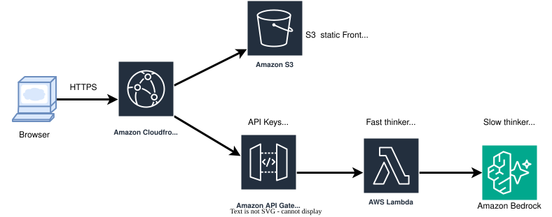

<div align="right">
  <sub>
    <a href="README.md">English</a> |
    <strong>中文</strong>
  </sub>
</div>

# The Norn Machine：确定性上下文组装

## 一个无服务器，无状态的云原生提示词引擎

**版本**：2.0 MVP  
**作者**：Leo  
**日期**：2026 年 4 月  
**在线体验**：[https://d3gncg0hircdt9.cloudfront.net/](https://d3gncg0hircdt9.cloudfront.net/)

The Norn Machine 是一个以“直觉选图”解读性格为外壳的确定性上下文组装引擎。玩家看到的是一场带有仪式感的选图测试，但这篇文档真正讨论的是一套方法：如何捕捉轻量行为信号，如何把它们组装成受约束的上下文，如何优化 prompt，并把整条链路跑在云端。

它背后的工程原则很简单：

**确定性代码负责判断，大语言模型负责表达。**

系统内部并不会把原始行为长期存起来，而是把当前请求中的轻量行为信号压缩成稳定的行为画像，再交给模型生成可读的结果。

## 为什么这样设计

很多 LLM 应用会让模型同时负责推理、记忆、事实选择、安全边界和语言表达。这很灵活，但也容易带来输出不稳定、上下文变长、延迟升高和幻觉风险。

The Norn Machine 把模型的职责收窄。模型收到的不是一堆原始选择记录，也不是让它凭感觉自由判断，而是一份结构化画像：

- 决策方式
- 关系模式
- 压力反应
- 盲区
- 建议
- 可选的情绪与画面锚点

模型仍然重要，但它负责的是语言渲染，而不是判断权本身。

## 系统架构



这张架构图展现了如何达到目前的 MVP 实现。CloudFront 是公网 HTTPS 入口，S3 提供静态前端，API Gateway 用 API Key 和 Usage Plan 保护后端入口，Lambda 运行确定性上下文组装，Amazon Bedrock 负责最终语言渲染。

API Gateway 承载两个请求型能力：结果分析和最后对话。二者遵守同一个契约：浏览器提交当前 payload，Lambda 将其压缩成结构化上下文，模型只接收这份受约束的上下文，而不是原始会话历史。

这也是 stateless 的核心：没有数据库保存玩家会话，没有跨用户记忆。Prompt 规则和后端输出护栏共同杜绝用户数据泄露风险。

## 运行流水线

### 1. 前端交互

玩家在多轮图片卡牌中做选择。每一轮都允许单选、多选，甚至不选。前端只收集当前测试所需的轻量信号：

- 被选择的卡牌 ID 与轮次
- 总轮数
- 每轮停留时长
- 已选卡牌被取消的事件

如果玩家完全不选就揭示结果，前端和后端都会返回固定的玄学兜底结果，不再等待模型推理，也不会卡死。

### 2. Fast Thinker

Fast Thinker 是纯确定性 Python 计算层，也是整个项目的精髓：模型不负责判断玩家是谁，模型只接收代码已经压缩好的画像。

每张卡牌都带有四轴坐标，以及策展好的特质、意象、场景和 rationale。玩家每选择一张卡，Fast Thinker 会先计算这次选择的权重：

```text
selection_weight = exp(round_number / total_rounds) * hesitation_bonus
```

越靠后的轮次权重越高，因为玩家看过更多卡牌后，后期选择通常更接近真实偏好。犹豫时间只作为很小的修正：系统会在当前测试内部归一化每轮停留时长，并把它限制在 `1.0x` 到 `1.12x` 之间，避免图片加载和渲染时间污染判断。

最终坐标是加权平均：

```text
final_axis_value = sum(card_axis_value * selection_weight) / sum(selection_weight)
```

取消已选卡牌单独处理，因为“选了又撤回”比单纯停留更能表达复核、摇摆或不愿过早定型。系统会统计取消事件，估算 revision strength，对开放/收束轴做轻微修正，并把“选择复核”“反复校准”等特质并入同一轮聚合。

同一套权重也会用于聚合特质、意象、场景和 rationale。最后，标志性信号会从意象中选出一个词级钩子，计算方式是加权频率乘以它和最终坐标向量的余弦贴合度：

```text
signature_score = weighted_frequency * (1 + max(cosine_similarity, 0))
```

这样结果里可以出现一个具体物件，让玩家感到系统确实读到了选择，但不会让模型把回答写成“你选了哪些图”的清单。

当前信号来源包括：

- **轮次衰减**：越靠后的选择权重越高，因为后期选择通常更接近真实偏好。
- **犹豫加权**：停留时长只作为很小的修正，因为图片加载和渲染时间会污染原始时长。
- **取消已选卡牌**：取消行为比单纯犹豫更能代表复核、摇摆或不愿过早定型。
- **意象聚合**：特质、物件、场景和 rationale 会跟随同一套权重一起聚合。
- **标志性信号**：从加权意象频率和最终坐标向量的余弦相似度中，提取一个词级钩子，只保留一个足够具体的物件或意象。

标志性信号不是额外的推理层。它已经并入同一次聚合计算，避免为了一个小功能把架构撑大。

### 3. Template Router

Template Router 根据输入信息量选择不同 Prompt 模式：

- 1-5 轮：短结果，偏直觉流；开放 1 次追问。
- 6-20 轮：更锋利的行为分析；开放 2 次追问。
- 20 轮以上：更长的反思型结果；开放 3 次追问。

不同模式可以有不同风格，但都必须围绕同一套行为画像骨架生成。

### 4. Slow Thinker

Slow Thinker 调用 Bedrock 生成最终文本。模型接收的是压缩后的结构化事实和少量 few-shot 示例。它的任务是把具体画面锚点翻译成更宽泛的情绪、行为和关系模式，而不是复述玩家选过哪些图。

### 5. 最后对话

结果文本出现后，最后对话浮窗再延迟浮现。用户输入限制在 100 字以内，对话轮数严格绑定前面的选择轮数。达到限制后，系统用符合世界观的表达收束，而不是继续开放聊天。

## 前端体验

前端是静态页面。结果页的 canvas 粒子动画分为三段：

1. 等待分析时，粒子向中心聚集；
2. 结果文字出现；
3. 结果可见后，中心粒子再向外消散。

动画出现的时机很重要。消散动画应该属于“结果出现之后”的体验，而不是在 API 等待过程中悄悄播完。

音乐绑定在“开始测试”的点击事件上触发，符合浏览器自动播放限制，也让声音进入得更自然。

## 安全与隐私

- 不使用数据库保存玩家会话。
- 后端只处理当前请求中的 payload。
- 对话有轮数限制和 100 字输入限制。
- API Gateway 提供 API Key 校验和调用频率限制。
- Prompt 规则和后端输出护栏提供额外的安全检查。
- 公网入口应走 CloudFront HTTPS，而不是直接暴露 S3 网站端点。

## 可迁移的模式

这个项目真正可迁移的不是性格测试这个主题，而是：

**隐性行为捕捉 + 确定性状态压缩 + 模型语言渲染**

它可以迁移到：

- **对话式商品推荐**：从浏览、停留、取消等行为推断偏好表达方式，再让模型解释确定性的候选商品。
- **智能客服**：业务状态和合规边界由代码维护，模型只负责生成受限回答。
- **游戏 NPC**：事实和状态由游戏规则决定，模型负责用角色语气表达。
- **个人 AI 名片**：根据访客浏览行为调整介绍重点，但履历事实保持确定。

## 附录：资产管线概念

图片管线依赖策展式 metadata，而不是随机 prompt 生成。

每张卡牌都包含：

- 人格坐标向量
- 所属角色组
- 特质关键词
- 视觉意象
- 场景 rationale
- 人物出现策略
- 风格、色板和构图字段

图片管理器的作用是保持卡牌集合的一致性：生成策展 metadata、检查重复 prompt、追踪图片状态，并导出前后端需要的数据。管理脚本已经在仓库中，README 不再展开脚本代码。这里真正重要的是数据契约：每张图既是视觉资产，也是结构化语义信号。

## 结论

The Norn Machine 是一个很小的 demo，但它测试的是一个更大的架构判断：越重要的判断，越应该先被系统压缩成可追踪的上下文，再交给模型表达。代码负责压缩和约束世界，模型负责让这个被压缩后的世界变得可读。

<p align="center"><sub>The Norn Machine: A serverless, stateless prompt engine</sub></p>
