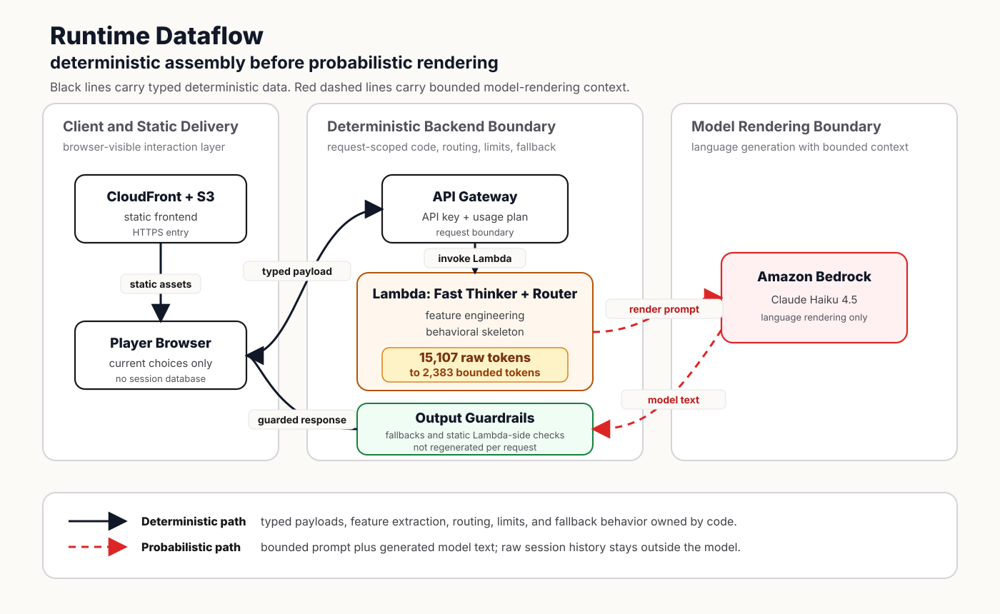
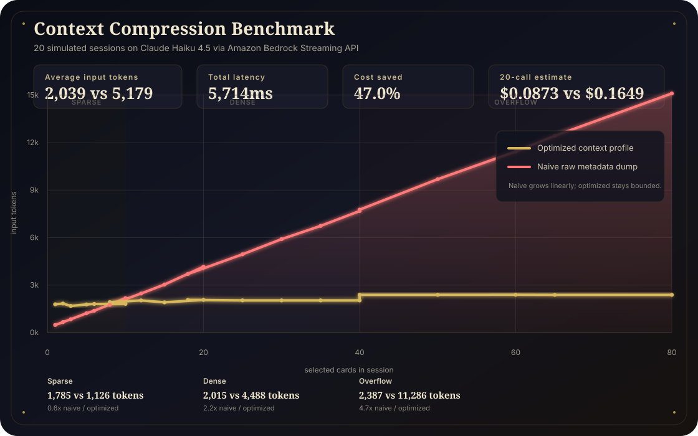
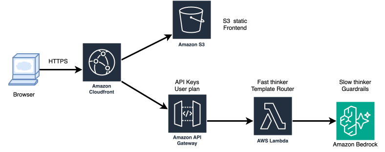

  
    <a href="README.md">English</a> |
    <strong>中文</strong>
  

# The Norn Machine：确定性上下文组装

## 一个无服务器，无状态的云原生提示词引擎

**版本**：2.0 MVP  
**作者**：Leo  
**日期**：2026 年 4 月  
**在线体验**：[https://d3gncg0hircdt9.cloudfront.net/](https://d3gncg0hircdt9.cloudfront.net/)

The Norn Machine 是一个以“直觉选图”解读性格为外壳的确定性上下文组装引擎。玩家看到的是一场带有仪式感的选图测试，但这篇文档真正讨论的是一套方法：如何捕捉轻量行为信号，如何把它们组装成受约束的上下文，如何优化 prompt，并把整条链路跑在云端。

它背后的工程原则很简单：

**确定性代码负责判断，大语言模型负责表达。**

系统内部并不会把原始行为长期存起来，而是把当前请求中的轻量行为信号压缩成稳定的行为画像，再交给模型生成可读的结果。

## 运行时数据流

这张架构图把项目中两类计算明确分开：

- **黑色实线**：从浏览器到 API Gateway，再到 Lambda 的确定性强类型数据流。
- **红色虚线**：从 Lambda 到 Amazon Bedrock 的概率性语言渲染流。

关键压缩点发生在 Lambda 内部。在 overflow 基准测试中，原始交互历史达到 15,107 input tokens，但 Fast Thinker 会先把这段历史折叠成 2,383 bounded prompt tokens，再交给模型。这里才是系统的核心主张：不要让 LLM 承担无边界历史记录，代码应该先把真正相关的状态组装出来。

## 基准测试证据

基准测试把这个项目最核心的架构主张变成了可观察的数据：我们用同一个模型，对比了生产架构中的确定性上下文组装，以及一个把所有已选卡牌 metadata 直接拼进提示词的原版提示词测试组。

| 指标 | 优化后提示词 | 原版提示词 | 结果 |
|:--|:--:|:--:|:--|
| 平均输入 token | 2,039 | 5,179 | 输入上下文减少 2.5x |
| 平均总延迟 | 5,714ms | 6,822ms | 端到端延迟降低 16.2% |
| 20 次调用估算费用 | $0.0873 | $0.1649 | 成本降低 47.0% |
| overflow 场景输入 token | 2,387 | 11,286 | 长会话上下文减少 4.7x |

**Overflow 案例**

| 场景 | 原版提示词 | 优化后提示词 | 变化 |
|:--|:--:|:--:|:--|
| 30 轮 / 80 次选择 | 15,107 input tokens | 2,383 input tokens | 原始卡牌历史被压缩成有界行为画像 |
| 同一场景总延迟 | 9,373ms | 6,179ms | 上下文增长被控制后，端到端延迟下降 |

在深入分析数据前，我们需要定义三种交互深度：**短上下文场景（sparse 场景，1-5 次选择）**、**足量上下文场景（dense 场景，6-20 次选择）**以及**过量上下文场景（overflow 场景，>20 次选择）**。

在 sparse 场景中，优化后提示词并不总是比原版提示词更短。因为在只需要发送极少量原始 metadata 的时候，我们的优化管线会主动将一部分固定上下文预算投入到系统规则、few-shot 示例和行为画像骨架的构建中。这是为了确保模型在少量信息下依然能输出高质量且风格统一的回答。

真正的架构优势在于其极强的 **token 一致性**：当交互深度进入 dense 甚至 overflow 场景时，原版提示词的长度会随着用户的每一次选择不断膨胀（在我们的测试中最高达到 15,107 token）。而优化后提示词的长度始终保持在 1,800 到 2,400 token 之间。这是因为 Fast Thinker 纯代码层在将数据发给大语言模型前，已经将所有卡牌特征压缩成了一份固定格式的稳定行为画像。不论用户选了 1 张还是 80 张图，模型最终接收到的都是这份高度凝练的画像，而非原始的历史记录。

在首字延迟（TTFT）方面，测试数据没有被隐藏：优化后提示词的首字延迟反而略慢（优化后平均 914ms，原版平均 867ms）。TTFT 会受到服务调度、prompt 结构和单次运行波动影响，所以这里不把它包装成架构优势。本项目真正验证的是另一件事：当交互进入非平凡规模时，确定性压缩可以控制上下文增长，降低输出负担，降低总延迟，并降低调用成本。

在成本控制上，数据的冲击力更加直观：在目前测试的结果下，平均长度 5,179 个 token 的原版提示词，20 次调用的平均总费用为 0.1649 美元（约 1.2 元人民币）。而采用确定性压缩架构后，平均只需 0.0873 美元（约 0.6 元人民币），直接节省了 47% 的调用成本。在极端的 overflow 场景下，这种绝对的一致性优势甚至能扩大到节省超过 80% 的成本。

## 为什么这样设计

很多 LLM 应用会让模型同时负责推理、记忆、事实选择、安全边界和语言表达。这很灵活，但也容易带来输出不稳定、上下文变长、延迟升高和幻觉风险。

The Norn Machine 把模型的职责收窄。模型收到的不是一堆原始选择记录，也不是让它凭感觉自由判断，而是一份结构化画像：

- 决策方式
- 关系模式
- 压力反应
- 盲区
- 建议
- 可选的情绪与画面锚点

模型仍然重要，但它负责的是语言渲染，而不是判断权本身。

| Overflow 交互痛点 | 传统 Agentic 架构 | The Norn Machine 架构 |
|:--|:--|:--|
| 全局逻辑由谁负责？ | LLM 在同一次调用里负责推理状态、执行规则、记忆上下文和生成文本。 | Python 负责特征提取、路由、限制和兜底；LLM 只负责渲染受约束的语言。 |
| 历史记录变长后会怎样？ | Prompt 随原始日志增长，容易逼近上下文溢出。 | 原始选择先被压缩为固定格式的行为画像，再进入模型。 |
| 延迟表现 | 历史越长，模型需要扫描的输入越多，总延迟越不可控。 | Bedrock 基准测试中，平均端到端延迟下降 16.2%。 |
| 规则遵从 | 规则和长历史混在同一个 prompt 里竞争注意力。 | 字数、轮数、fallback、输出护栏尽量由模型外的代码执行。 |
| 失败形态 | 用户可能看到脆弱的模型行为或基础设施报错。 | 确定性兜底文本让体验在失败时仍然保持完整。 |

## 相关研究：Compiled AI

相似的架构趋势已经出现在近期系统研究中。2026 年 4 月的 arXiv 论文 [*Compiled AI: Deterministic Code Generation for LLM-Based Workflow Automation*](https://arxiv.org/abs/2604.05150) 讨论了一类工作流：在生成期或编译期使用 LLM 生成确定性控制代码，而部署后的实际用户请求只执行这些静态代码，不再进行运行时模型调用。

论文报告称，在 BFCL 函数调用任务上，Compiled AI 达到 96% 的任务完成率，并在执行阶段实现 zero execution tokens；当同一工作流执行到约 17 次交易后，编译成本开始被摊平；执行 1,000 次交易时，token 使用量相比运行时 LLM 推理降低 57 倍。延迟对比也很直接：编译后代码执行的 P50 延迟为 4.5ms，而直接运行时 LLM 推理为 2,004ms。

The Norn Machine 不是完整的 Compiled AI 系统，因为它仍然会调用 Bedrock 渲染最终语言。它更接近一个混合型变体：确定性代码负责状态压缩、路由、护栏和兜底，模型只保留为有界语言渲染器。也就是说，它还没有达到 zero-token execution，但方向是一致的：把可重复的控制逻辑从运行时模型调用中移出来。

## 系统架构

这张架构图展现了如何达到目前的 MVP 实现。CloudFront 是公网 HTTPS 入口，S3 提供静态前端，API Gateway 用 API Key 和 Usage Plan 保护后端入口，Lambda 运行确定性上下文组装，Amazon Bedrock 负责最终语言渲染。

API Gateway 承载两个请求型能力：结果分析和最后对话。二者遵守同一个契约：浏览器提交当前 payload，Lambda 将其压缩成结构化上下文，模型只接收这份受约束的上下文，而不是原始会话历史。

这也是 stateless 的核心：没有数据库保存玩家会话，没有跨用户记忆。Prompt 规则和后端输出护栏共同杜绝用户数据泄露风险。

## 运行流水线

### 1. 前端交互

玩家在多轮图片卡牌中做选择。每一轮都允许单选、多选，甚至不选。前端只收集当前测试所需的轻量信号：

- 被选择的卡牌 ID 与轮次
- 总轮数
- 每轮停留时长
- 已选卡牌被取消的事件

如果玩家完全不选就揭示结果，前端和后端都会返回固定的玄学兜底结果，不再等待模型推理，也不会卡死。

### 2. Fast Thinker

Fast Thinker 是纯确定性 Python 计算层，也是整个项目的精髓：模型不负责判断玩家是谁，模型只接收代码已经压缩好的画像。

每张卡牌都带有四轴坐标，以及策展好的特质、意象、场景和 rationale。玩家每选择一张卡，Fast Thinker 会先计算这次选择的权重：

$$
W_i = \exp\left(\frac{r_i}{R}\right) \times \beta_{h,i}
$$

其中 \(r_i\) 是第 \(i\) 张卡被选择的轮次，\(R\) 是总轮数，\(\beta_{h,i}\) 是被严格限制上限的犹豫修正因子：

$$
\beta_{h,i} = 1 + \hat{d}_{r_i} \times (1.12 - 1.00)
$$

$$
\hat{d}_r = \frac{\mathrm{clip}(d_r, 0, 45000) - d_{min}}{\max(d_{max} - d_{min}, 1)}
$$

越靠后的轮次权重越高，因为玩家看过更多卡牌后，后期选择通常更接近真实偏好。犹豫时间只作为很小的修正：系统会在当前测试内部归一化每轮停留时长，并把它限制在 `1.0x` 到 `1.12x` 之间，避免图片加载和渲染时间污染判断。

最终坐标是加权平均：

$$
\bar{x}_{dim} = \frac{\sum_i W_i \cdot x_{i,dim}}{\sum_i W_i}
$$

取消已选卡牌单独处理，因为“选了又撤回”比单纯停留更能表达复核、摇摆或不愿过早定型。系统会统计取消事件，估算 revision strength，对开放/收束轴做轻微修正，并把“选择复核”“反复校准”等特质并入同一轮聚合。

$$
S_{revision} = \min\left(\frac{D / R}{1.5}, 1\right)
$$

$$
\bar{x}_{J/P}' = \bar{x}_{J/P} - S_{revision} \times 2.4
$$

同一套权重也会用于聚合特质、意象、场景和 rationale。最后，标志性信号会从意象中选出一个词级钩子，计算方式是加权频率乘以它和最终坐标向量的余弦贴合度：

$$
score(m) = F_m \times \left(1 + \max(\cos(\bar{x}_m, \bar{x}), 0)\right)
$$

这样结果里可以出现一个具体物件，让玩家感到系统确实读到了选择，但不会让模型把回答写成“你选了哪些图”的清单。

当前信号来源包括：

- **轮次衰减**：越靠后的选择权重越高，因为后期选择通常更接近真实偏好。
- **犹豫加权**：停留时长只作为很小的修正，因为图片加载和渲染时间会污染原始时长。
- **取消已选卡牌**：取消行为比单纯犹豫更能代表复核、摇摆或不愿过早定型。
- **意象聚合**：特质、物件、场景和 rationale 会跟随同一套权重一起聚合。
- **标志性信号**：从加权意象频率和最终坐标向量的余弦相似度中，提取一个词级钩子，只保留一个足够具体的物件或意象。

标志性信号不是额外的推理层。它已经并入同一次聚合计算，避免为了一个小功能把架构撑大。

### 3. Template Router

Template Router 根据输入信息量选择不同 Prompt 模式：

- 1-5 轮：短结果，偏直觉流；开放 1 次追问。
- 6-20 轮：更锋利的行为分析；开放 2 次追问。
- 20 轮以上：更长的反思型结果；开放 3 次追问。

不同模式可以有不同风格，但都必须围绕同一套行为画像骨架生成。

### 4. Slow Thinker

Slow Thinker 调用 Bedrock 生成最终文本。模型接收的是压缩后的结构化事实和少量 few-shot 示例。它的任务是把具体画面锚点翻译成更宽泛的情绪、行为和关系模式，而不是复述玩家选过哪些图。

### 5. 最后对话

结果文本出现后，最后对话浮窗再延迟浮现。用户输入限制在 100 字以内，对话轮数严格绑定前面的选择轮数。达到限制后，系统用符合世界观的表达收束，而不是继续开放聊天。

## 前端体验

前端是静态页面。结果页的 canvas 粒子动画分为三段：

1. 等待分析时，粒子向中心聚集；
2. 结果文字出现；
3. 结果可见后，中心粒子再向外消散。

动画出现的时机很重要。消散动画应该属于“结果出现之后”的体验，而不是在 API 等待过程中悄悄播完。

音乐绑定在“开始测试”的点击事件上触发，符合浏览器自动播放限制，也让声音进入得更自然。

## 边界情况与护栏

系统的稳健性来自一个很朴素的原则：在把失败暴露给用户之前，先让确定性代码接管。

| 边界情况 | 确定性控制点 | 用户看到的结果 |
|:--|:--|:--|
| 玩家完全不选卡牌 | 前端和 Lambda 都识别空 `selections` | 直接返回固定的玄学兜底结果，不调用 Bedrock。 |
| Bedrock 调用失败或被 guardrail 阻断 | `slow_thinker` 捕获异常或 guardrail intervention | 用安全 fallback 文本替代模型输出。 |
| 模型输出内部字段或跨用户比较 | 后端输出护栏扫描坐标、置信度、上一位玩家等禁用片段 | 输出被替换成中性的受保护回复。 |
| 最后对话超过允许轮数 | 服务端根据总轮数重新计算上限 | 直接返回固定的收束文本，不继续调用模型。 |
| 最后对话输入超过 100 字 | 前端和后端都做长度校验 | 请求在进入模型前被拒绝。 |
| 本地预览缺少 API 配置 | 前端配置加载器识别 endpoint/key 缺失 | 页面显示符合世界观的后端未连接提示，而不是一直卡住。 |

这也是把模型排除在控制平面之外的实际价值：模型可以失败、被拦截，甚至偶尔说出不该说的话，但最终体验边界仍然由代码把住。

## 安全与隐私

- 不使用数据库保存玩家会话。
- 后端只处理当前请求中的 payload。
- 对话有轮数限制和 100 字输入限制。
- API Gateway 提供 API Key 校验和调用频率限制。
- Prompt 规则和后端输出护栏提供额外的安全检查。
- 公网入口应走 CloudFront HTTPS，而不是直接暴露 S3 网站端点。

## 可迁移的模式

这个项目真正可迁移的不是性格测试这个主题，而是：

**隐性行为捕捉 + 确定性状态压缩 + 模型语言渲染**

它可以迁移到：

- **对话式商品推荐**：从浏览、停留、取消等行为推断偏好表达方式，再让模型解释确定性的候选商品。
- **智能客服**：业务状态和合规边界由代码维护，模型只负责生成受限回答。
- **游戏 NPC**：事实和状态由游戏规则决定，模型负责用角色语气表达。
- **个人 AI 名片**：根据访客浏览行为调整介绍重点，但履历事实保持确定。

## 技术展望

当前 Fast Thinker 本质上是一个可解释的规则专家系统。它的参数是清晰可审计的：犹豫时间最多只提供 `1.12x` 加成，取消已选卡牌只会对 J/P 轴做有上限的轻微修正，标志性信号来自加权频率与余弦贴合度。这让系统很容易解释，但也意味着权重仍然来自领域判断，而不是数据训练。

自然的下一步，是把它拆成一个独立的数据驱动行为意图引擎。在获得明确授权并完成匿名化处理的前提下，同一套交互层可以学习点击节奏、悬停时长、撤回频率、滚动深度、参数对比行为和最终结果之间的非线性关系。那时目标就不再是“性格解读”，而是在决定性动作发生之前进行早期意图预测。

| 当前 MVP | 数据驱动后继项目 |
|:--|:--|
| 人工设定特征权重 | 学习得到的隐向量与校准权重 |
| 无状态请求 payload | 经授权、匿名化的行为事件数据集 |
| 提交后生成描述性结果 | 最终动作前进行意图预测 |
| 确定性 prompt 组装 | 带确定性护栏的模型辅助干预策略 |

这会把项目从可解释上下文组装，推进到多模态行为意图预测与自适应干预引擎。底层原则仍然不变：不要把无边界控制权交给模型，边界必须由代码把住。

## 附录：资产管线概念

图片管线依赖策展式 metadata，而不是随机 prompt 生成。

每张卡牌都包含：

- 人格坐标向量
- 所属角色组
- 特质关键词
- 视觉意象
- 场景 rationale
- 人物出现策略
- 风格、色板和构图字段

图片管理器的作用是保持卡牌集合的一致性：生成策展 metadata、检查重复 prompt、追踪图片状态，并导出前后端需要的数据。管理脚本已经在仓库中，README 不再展开脚本代码。这里真正重要的是数据契约：每张图既是视觉资产，也是结构化语义信号。

## 附录：基准测试产物

基准测试相关文件保留在仓库里，方便读者检查这些数字，而不是只把它们当成文档里的结论：

- [`generate_scenarios.py`](the-norn-machine/backend/benchmark/generate_scenarios.py)：生成 20 组覆盖 sparse、dense、overflow 交互模式的模拟会话。
- [`run_bedrock_benchmark.py`](the-norn-machine/backend/benchmark/run_bedrock_benchmark.py)：通过 Amazon Bedrock Streaming API 调用 Claude Haiku 4.5，并记录 token、TTFT、总延迟和估算费用。
- [`benchmark_prompts.json`](the-norn-machine/backend/benchmark/benchmark_prompts.json)：保存优化版和朴素版的 prompt 对照数据。
- [`benchmark_results.json`](the-norn-machine/backend/benchmark/benchmark_results.json)：保存原始 API 测量结果和汇总数据。
- [`benchmark_summary.svg`](the-norn-machine/backend/benchmark/benchmark_summary.svg)：README 中使用的上下文增长曲线图。
- [`c4-dataflow.svg`](the-norn-machine/docs/c4-dataflow.svg)：展示运行时数据流中的确定性边界与概率性边界。
- [`Norn-machine.drawio.svg`](the-norn-machine/Norn-machine.drawio.svg)：展示 MVP 使用的 AWS 拓扑结构。

## 结论

The Norn Machine 是一个很小的 demo，但它测试的是一个更大的架构判断：越重要的判断，越应该先被系统压缩成可追踪的上下文，再交给模型表达。代码负责压缩和约束世界，模型负责让这个被压缩后的世界变得可读。

The Norn Machine: A serverless, stateless cloud-native prompt engine

